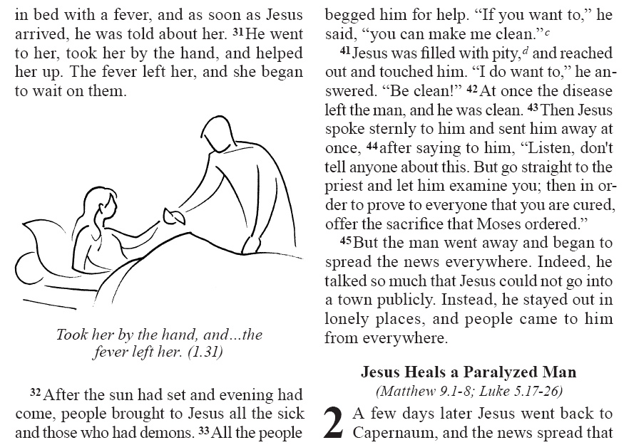

.. include:: /_static/inc_styles.txt

.. index:: characters, special text

Words and Characters
====================

.. toctree::
   :maxdepth: 2

   Character Marker Nesting <nesting>
   Word Level Attributes <attributes>
   Linking Attributes <linking>

-----

**Notes about character-level markup in USFM:**

Elements in this section mark portions of text within a larger paragraph unit. This type of element is often referred to generically as a character style, where the larger containing text units are often referred to as paragraph styles. In the case of a text markup scheme like USFM, the term “style” is somewhat misleading, in that the essential goal of USFM it to mark common scriptural element types, and not formatting information. Bearing that in mind, USFM has also inherited and attempted to unify a long history of SFM type scripture markup “standards”, some of which were more or less strict in their tolerance for format-oriented markers. We have not wished to create an unworkable migration task for legacy SFM encoded texts.

Translation editing software which implement support for USFM encoded text may provide a formatted view of the text using a set of style definitions for each USFM marker. These “stylesheets” most often refer to the formatting definitions as paragraph and character styles.

.. note::

	**About nesting character level markup in USFM (>2.4):** USFM 2.4 adds a new syntax for indicating that a nesting of one character level marker within another is taking place within a text. See :doc:`Character Marker Nesting </characters/nesting>` for details.

-----

Special Text
------------

.. _usfmc_add:
.. index:: marker (\add ...\add*)

\\add ...\\add\*
^^^^^^^^^^^^^^^^
:Syntax: ``\add_text...\add*``
:Type: character
:Added: 1.0
:Use: Translator's addition. |br|
	A translator's explanation; words added by the translator for clarity – text which is not literally a part of the original language, but which was supplied to make the meaning of the original clear.

**Text and Formatting Sample** - Genesis 5.29 (Russian Synodal, Protestant Version)

.. code-block:: text
	:name: usfm-character_add_example
	:emphasize-lines: 3

	\p
	\v 29 И нарек ему имя: Ной, сказав: он утешит нас в работе нашей и в трудах рук 
	наших при \add возделывании\add* земли, которую проклял Господь.

.. image:: images/usfm-character_add.jpg
	:width: 250px

-----

.. _usfmc_bk:
.. index:: marker (\bk ...\bk*)

\\bk ...\\bk\*
^^^^^^^^^^^^^^
:Syntax: ``\bk_text...\bk*``
:Type: character
:Added: 1.0
:Use: Quoted book title.

**Text and Formatting Sample** - Introduction to Mark (GNT)

.. code-block:: text
	:name: usfm-character_bk_example
	:emphasize-lines: 4-5

	\mt1 THE ACTS
	\mt2 of the Apostles
	\is Introduction
	\ip \bk The Acts of the Apostles\bk* is a continuation of \bk The Gospel according 
	to Luke\bk* Its chief purpose is to tell how Jesus' early followers, led by the Holy 
	Spirit, spread the Good News about him “in Jerusalem, in all of Judea and Samaria, 
	and to the ends of the earth” (1.8).

.. image:: images/usfm-character_bk.jpg
	:width: 250px

-----

.. _usfmc_dc:
.. index:: marker (\dc ...\dc*)

\\dc ...\\dc\*
^^^^^^^^^^^^^^
:Syntax: ``\dc_text...\dc*``
:Type: character
:Added: 1.0
:Use: Deuterocanonical/LXX additions or insertions in the Protocanonical text. |br|
	General purpose use of ``\dc ...\dc*`` or :doc:`nested </characters/nesting>` ``\+dc ...\+dc*`` is encouraged wherever DC-only content is being marked. Use of context-specific DC-only markup (i.e. :ref:`\\fdc ...\\fdc\* <usfmc_fdc>`, :ref:`\\xdc ...\\xdc\* <usfmc_xdc>`) is discouraged.

**Text and Formatting Samples** - Hebrews 1.3 (Spanish DHE - footnote)

.. code-block:: text
	:name: usfm-character_dc_example
	:emphasize-lines: 2

	\v 3 Él es el resplandor glorioso de Dios,\f c \fr 1.3: \fk Resplandor: \ft Cf. 
	Jn 1.4-9,14\+dc ; también Sab 7.25-26, donde algo parecido se dice de la sabiduría\+dc*.\f* 
	la imagen misma de lo que Dios es y el que sostiene todas las cosas con su palabra 
	poderosa. Después de limpiarnos de nuestros pecados, se ha sentado en el cielo, a la 
	derecha del trono de Dios,
	\v 4 y ha llegado a ser superior a los ángeles, pues ha recibido en herencia un título 
	mucho más importante que el de ellos.

Psalm 115.3-4 (GNT - cross references)

.. code-block:: text
	:name: usfm-character_dc_example2
	:emphasize-lines: 5

	\q1
	\v 3 Our God is in heaven;
	\q2 he does whatever he wishes.
	\q1
	\v 4 \x - \xo 115.4-8: \xt Ps 135.15-18; \+dc Ltj Jr 4-73; \+dc*\xt Rev 9.20.\x* Their 
	gods are made of silver and gold,
	\q2 formed by human hands.

1 Corinthians 15.51-52 (GNT - cross reference)

.. code-block:: text
	:name: usfm-character_dc_example3
	:emphasize-lines: 2

	\p
	\v 51-52 \x - \xo 15.51,52: \xt \+dc 2Es 6.23; \+dc*1Th 4.15-17.\x* Listen to this secret 
	truth: we shall not all die, but when the last trumpet sounds, we shall all be changed 
	in an instant, as quickly as the blinking of an eye. For when the trumpet sounds, the 
	dead will be raised, never to die again, and we shall all be changed.

-----

.. _usfmc_k:
.. index:: marker (\k ...\k*)

\\k ...\\k\*
^^^^^^^^^^^^
:Syntax: ``\k_text...\k*``
:Type: character
:Added: 1.0
:Use: Keyword / keyterm

-----

.. _usfmp_lit:
.. index:: marker (\lit)

\\lit
^^^^^
:Syntax: ``\lit_text...``
:Type: paragraph
:Added: 1.0
:Use: Liturgical note/comment. (e.g. a guide which tells the reader/worshipper that he should recite a prayer or recitation etc.) |br|
	*A paragraph style.*

**Text and Formatting Sample** - Psalm 3 (Russian Synodal, Orthodox Version)

.. code-block:: text
	:name: usfm-paragraph_lit_example
	:emphasize-lines: 14

	\c 3
	\d
	\v 1 Псалом Давида, когда он бежал от Авессалома, сына своего.
	\p
	\v 2 Господи! как умножились враги мои! Многие восстают на меня;
	\v 3 многие говорят душе моей: «нет ему спасения в Боге».
	\v 4 Но Ты, Господи, щит предо мною, слава моя, и Ты возносишь голову мою.
	\v 5 Гласом моим взываю к Господу, и Он слышит меня со святой горы Своей.
	\v 6 Ложусь я, сплю и встаю, ибо Господь защищает меня.
	\v 7 Не убоюсь тем народа, которые со всех сторон ополчились на меня.
	\v 8 Восстань, Господи! спаси меня, Боже мой! ибо Ты поражаешь в ланиту всех врагов 
	моих; сокрушаешь зубы нечестивых.
	\v 9 От Господа спасение. Над народом Твоим благословение Твое.
	\lit Слава:

*Слава: = "Glory".*

.. image:: images/usfm-paragraph_lit.jpg
	:width: 250px

-----

.. _usfmc_nd:
.. index:: marker (\nd ...\nd*)

\\nd ...\\nd\*
^^^^^^^^^^^^^^
:Syntax: ``\nd_text...\nd*``
:Type: character
:Added: 1.0
:Use:  Name of God (name of Deity).

**Text and Formatting Sample** - Exodus 3.15 (GNT)

.. code-block:: text
	:name: usfm-character_??_example
	:emphasize-lines: 4

	\p
	\v 14 God said, “I am who I am. You must tell them: ‘The one who is called I AM  has 
	sent me to you.’
	\v 15 Tell the Israelites that I, the \nd Lord\nd*, the God of their ancestors, the God 
	of Abraham, Isaac, and Jacob, have sent you to them. This is my name forever; this is 
	what all future generations are to call me.

.. image:: images/usfm-character_nd.jpg
	:width: 250px

-----

.. _usfmc_ord:
.. index:: marker (\ord ...\ord*)

\\ord ...\\ord\*
^^^^^^^^^^^^^^^^
:Syntax: ``\ord_text...\ord*``
:Type: character
:Added: 1.0
:Use: Ordinal number ending (i.e. in "1st" — 1\\ord st\\ord*).

-----

.. _usfmc_pn:
.. index:: marker (\pn ...\pn*)

\\pn ...\\pn\*
^^^^^^^^^^^^^^
:Syntax: ``\pn_text...\pn*``
:Type: character
:Added: 1.0
:Use: Proper name.

-----

.. _usfmc_png:
.. index:: marker (\png ...\png*)

\\png ...\\png\*
^^^^^^^^^^^^^^^^

|badge_3.0|

:Syntax: ``\png_text...\png*``
:Type: character
:Added: 3.0
:Use: Geographic proper name.

-----

.. _usfmc_addpn:
.. index:: marker (\addpn ...\addpn*)

\\addpn ...\\addpn\*
^^^^^^^^^^^^^^^^^^^^
:Syntax: ``\addpn_text...\addpn*``
:Type: character
:Added: 2.0
:Deprecated: 3.0  |badge_3.0|
:Use: Support for overlapping :ref:`\\pn ...\\pn\* <usfmc_pn>` and :ref:`\\add ...\\add\* <usfmc_add>` occurrences in Chinese texts. |br|
	**Deprecated** (i.e. use is strongly discouraged). |br| |br|
	|ico_Cg| *Recommended alternate:* :doc:`Nested </characters/nesting>` :ref:`\\pn ...\\pn\* <usfmc_pn>` within :ref:`\\add ...\\add\* <usfmc_add>`.

-----

.. _usfmc_qt:
.. index:: marker (\qt ...\qt*)

\\qt ...\\qt\*
^^^^^^^^^^^^^^
:Syntax: ``\qt_text...\qt*``
:Type: character
:Added: 1.0
:Use: Quoted text. |br|
	Old Testament quotations in the New Testament, or other quotations.

**Text and Formatting Samples**

Poetic format, where all text is a quotation.

.. code-block:: text

	\q1 \qt ........................................\qt*
	\q2 \qt ........................................\qt*
	\q1 \qt ........................................\qt*
	\q2 \qt ........................................\qt*

Poetic format, where text is mixed (only some is a quotation).

.. code-block:: text

	\q1 \qt ...............\qt* ..............\qt ........\qt*
	\q2 \qt .....\qt* ................................
	\q1 ..................................................
	\q2 \qt.........................................\qt*

Mark 1.2-3 (GNT)

.. code-block:: text
	:name: usfm-character_qt_example
	:emphasize-lines: 4,5,7,8,9

	\p
	\v 1 This is the Good News about Jesus Christ, the Son of God.
	\v 2 It began as the prophet Isaiah had written:
	\q1 \qt “God said, ‘I will send my messenger ahead of you\qt*
	\q2 \qt to open the way for you.’\qt*
	\q1
	\v 3 \qt Someone is shouting in the desert,\qt*
	\q2 \qt ‘Get the road ready for the Lord;\qt*
	\q2 \qt make a straight path for him to travel!’ ”\qt*

.. image:: images/usfm-character_qt.jpg
	:width: 250px

-----

.. _usfmc_sig:
.. index:: marker (\sig ...\sig*)

\\sig ...\\sig\*
^^^^^^^^^^^^^^^^
:Syntax: ``\sig_text...\sig*``
:Type: character
:Added: 1.0
:Use: Signature of the author (of a letter or epistle). |br|

**Text and Formatting Sample** - Colossians 4.18 (GNT)

.. code-block:: text
	:name: usfm-character_sig_example
	:emphasize-lines: 2

	\p
	\v 18 With my own hand I write this: \sig Greetings from Paul\sig*. Do not forget 
	my chains!
	\cls May God's grace be with you.

.. image:: images/usfm-character_sig.jpg
	:width: 250px

-----

.. _usfmc_sls:
.. index:: marker (\sls ...\sls*)

\\sls ...\\sls\*
^^^^^^^^^^^^^^^^
:Syntax: ``\sls_text...\sls*``
:Type: character
:Added: 1.0
:Use: Passage of text based on a secondary language or alternate text source. |br|
	E.g. The French NBS02 has large sections of text in EZR and DAN in italics, to represent where the original text is in Aramaic, not Hebrew.

**Text and Formatting Sample** - Ezra 4.8—6.18 (NBS - French, Nouvelle Bible Segond)

.. code-block:: text
	:name: usfm-character_sls_example
	:emphasize-lines: 5-9

	\v 7 Et aux jours d'Artaxerxès, Bishlam, Mitredath, Tabéel et le reste de leurs 
	collègues écrivirent à Artaxerxès, roi de Perse. Le texte de la lettre fut écrit en 
	araméen, traduit en araméen.
	\p
	\v 8 \sls Rehoum, chancelier, et Shimshaï, secrétaire, écrivirent au roi Artaxerxès 
	la lettre suivante concernant Jérusalem, savoir:\sls*
	\v 9 \sls «Rehoum, chancelier, Shimshaï, secrétaire, et le reste de leurs collègues, 
	ceux de Dîn, d'Apharsatak, de Tarpel, d'Apharas, d'Erek, de Babylone, de Suse, de Déha, 
	d'Elam,\sls*
	...

.. image:: images/usfm-character_sls.jpg
	:width: 250px

-----

.. _usfmc_tl:
.. index:: marker (\tl ...\tl*)

\\tl ...\\tl\*
^^^^^^^^^^^^^^
:Syntax: ``\tl_text...\tl*``
:Type: character
:Added: 1.0
:Use: Transliterated (or foreign) word(s).

**Text and Formatting Sample** - Matthew 27.46 (GNT)

.. code-block:: text
	:name: usfm-character_tl_example
	:emphasize-lines: 5-6

	\s1 The Death of Jesus
	\r (Mark 15.33-41; Luke 23.44-49; John 19.28-30)
	\p
	\v 45 At noon the whole country was covered with darkness, which lasted for three hours.
	\v 46 At about three o'clock Jesus cried out with a loud shout, \tl “Eli, Eli, lema 
	sabachthani?”\tl* which means, “My God, my God, why did you abandon me?”

.. image:: images/usfm-character_tl.jpg
	:width: 250px

-----

.. _usfmc_wj:
.. index:: marker (\wj ...\wj*)

\\wj ...\\wj\*
^^^^^^^^^^^^^^
:Syntax: ``\wj_text...\wj*``
:Type: character
:Added: 2.0
:Use: Words of Jesus.

-----

Character Styling
-----------------

.. warning::

	**Note:** The use of formatting oriented character markup is strongly discouraged. Please search for the appropriate USFM element to markup content, wherever possible.

.. _usfmc_em:
.. index:: marker (\em ...\em*)

\\em ...\\em\*
^^^^^^^^^^^^^^
:Syntax: ``\em_text...\em*``
:Type: character
:Added: 2.0
:Use: Emphasis text.

-----

.. _usfmc_bd:
.. index:: marker (\bd ...\bd*)

\\bd ...\\bd\*
^^^^^^^^^^^^^^
:Syntax: ``\bd_text...\bd*``
:Type: character
:Added: 1.0
:Use: Bold text.

-----

.. _usfmc_it:
.. index:: marker (\it ...\it*)

\\it ...\\it\*
^^^^^^^^^^^^^^
:Syntax: ``\it_text...\it*``
:Type: character
:Added: 1.0
:Use: Italic text.

-----

.. _usfmc_bdit:
.. index:: marker (\bdit ...\bdit*)

\\bdit ...\\bdit\*
^^^^^^^^^^^^^^^^^^
:Syntax: ``\bdit_text...\bdit*``
:Type: character
:Added: 1.0
:Use: Bold-italic text.

-----

.. _usfmc_no:
.. index:: marker (\no ...\no*)

\\no ...\\no\*
^^^^^^^^^^^^^^
:Syntax: ``\no_text...\no*``
:Type: character
:Added: 1.0
:Use: Normal text. |br|
	May be used when a larger paragraph element is set in an alternate font style (e.g. italic), and a selected section of text should be displayed in normal text.

-----

.. _usfmc_sc:
.. index:: marker (\sc ...\sc*)

\\sc ...\\sc\*
^^^^^^^^^^^^^^
:Syntax: ``\sc_text...\sc*``
:Type: character
:Added: 1.0
:Use: Small-cap text.

-----

Spacing and Breaks
------------------

.. _usfmc_~:
.. index:: marker (~)

\~
^^
:Syntax: ``~``
:Type: character
:Added: 1.0
:Use: No-break space. |br|
	*c.f.* Unicode character U+00AO (NO-BREAK SPACE)

-----

.. _usfmc_//:
.. index:: marker (//)

//
^^
:Syntax: ``//``
:Type: character
:Added: 1.0
:Use: Discretionary (optional) line break. |br|
	Primarily used in :doc:`poetic </poetry/index>` text, but could also be used for marking optional breaks for :doc:`titles, headings </titles_headings/index>`, or :ref:`table cell <usfmc_tc#>` content breaks.

**Text and Formatting Sample** - Matthew 9.1 (GNT)

.. code-block:: text
	:name: usfm-character_//_example
	:emphasize-lines: 2

	\c 9
	\s1 Jesus Heals a Man // Who Could Not Walk
	\r (Mark 2.1-12; Luke 5.17-26)

.. image:: images/usfm-character_discBreak.jpg
	:width: 250px

-----

.. _usfmp_pb:
.. index:: marker (\pb)

\\pb
^^^^
:Syntax: ``\pb``
:Type: paragraph
:Added: 1.0
:Use: Explicit page break.

-----

Special Features
----------------

.. _usfmc_fig:
.. index:: marker (\fig ...\fig*)

\\fig ...\\fig\*
^^^^^^^^^^^^^^^^
:Syntax: ``\fig_caption text...|src="filename" size="size" ref="reference"\fig*``
:Type: paragraph
:Added: 1.0
:Updated: 3.0 (attributes)
:Use: For defining illustrations to be used within a publication.

.. caution:: |badge_3.0| **Significant syntax change from USFM 1.x / 2.x**

	The syntax for defining illustrations in USFM 3.0 follows the general syntax for providing :doc:`word level attributes </characters/attributes>`. In USFM 1.x and 2.x, markup for illustrations required a the content for a collection of parameters to be provided in a specific order, with items separated by a vertical bar (e.g ``\fig_DESC|FILE|SIZE|LOC|COPY|CAP|REF\fig*``). The use of marker attributes, and the use of a vertical bar as an attribute separator was unique to illustration markup in USFM 1.x and 2.x. In USFM 3.0 this syntax is deprecated in order to align the markup with the general syntax for :doc:`word level attributes </characters/attributes>`.

.. _usfmc_fig-attr:
.. index:: attributes (\fig ...\fig*)

.. rubric:: Attributes |ico_Tag|

|badge_3.0|

Following the syntax for :doc:`word level attributes </characters/attributes>`. Required attributes are indicated in the list below with a red asterisk :red:`*`.

* Multiple attributes are required. There is no single, un-named :ref:`default <attributes_default>`.
* **Compatibility with USFM 1.x and 2.x:** If a USFM parser encounters a list of un-named attributes using a vertical bar separator within ``\fig ...\fig*`` these should be interpreted according to the strict USFM 2.x order.

:alt: Short, free-form description of image
:src: :red:`*` Filename
:size: :red:`*` Illustration relative size. Options are ``col`` (illustration should be inserted inline within the current text column) or ``span`` (illustration should be inserted across - "spanning" - text columns)
:loc: Location / range. Specify a range of references at which the illustration might be inserted.
:copy: Rights holder / copyright information. This material will be used to provide appropriate illustration attribution in publications.
:ref: :red:`*` Scripture reference (e.g. Luke 19.5). This text may be (optionally) published together with the illustration caption.

**Text and Formatting Samples - Spanning Columns** - Mark 1.18 (GNT)

.. code-block:: text
	:name: usfm-character_fig-span_example
	:emphasize-lines: 5-6

	\p
	\v 16 As Jesus walked along the shore of Lake Galilee, he saw two fishermen, 
	Simon and his brother Andrew, catching fish with a net.
	\v 17 Jesus said to them, “Come with me, and I will teach you to catch people.”
	\v 18 At once they left their nets and went with him. \fig At once they left 
	their nets.|src="avnt016.jpg" size="span" ref="1.18"\fig*

.. image:: images/usfm-character_fig-span.jpg
	:width: 450px

**Current Column** - Mark 1.31 (GNT)

.. code-block:: text
	:name: usfm-character_fig-col_example
	:emphasize-lines: 4-5

	\v 30 Simon's mother-in-law was sick in bed with a fever, and as soon as Jesus 
	arrived, he was told about her.
	\v 31 He went to her, took her by the hand, and helped her up. The fever left 
	her, and she began to wait on them. \fig Took her by the hand, and...the fever 
	left her.|src="avnt017.tif" size="col" ref="1.31"\fig*
	\p
	\v 32 After the sun had set and evening had come ...

-----

.. _usfmc_ndx:
.. index:: marker (\ndx ...\ndx*)

\\ndx ...\\ndx\*
^^^^^^^^^^^^^^^^
:Syntax: ``\ndx_text...\ndx*``
:Type: character
:Added: 1.0
:Use: Subject index entry. |br|
	Surround word(s) with this markup to indicate that it appears (or should appear) in the subject index.

-----

.. _usfmc_rb:
.. index:: marker (\rb ...\rb*)

\\rb ...\\rb\*
^^^^^^^^^^^^^^

|badge_3.0|

:Syntax: ``\rb_annotated base text...\rb*``
:Type: character
:Added: 3.0
:Use: Annotated base text. |br|
	Used to mark the base text being annotated with ruby characters.

.. note::

	**About Ruby:** *Ruby* is the term used for a run of special text that is associated with another run of text referred to as the *base text*. Ruby text is used to provide a short annotation for the associated base text. It is most often used to provide a reading / pronunciation guide, especially for characters that are likely to be unfamiliar to the reader. Ruby text is usually presented alongside or above the base text, using a smaller typeface.

-----

.. _usfmc_rt:
.. index:: marker (\rt ...\rt*)

\\rt ...\\rt\*
^^^^^^^^^^^^^^

|badge_3.0|

:Syntax: ``\rt_annotation text...\rt*``
:Type: character
:Added: 3.0
:Use: Ruby annotation text. |br|
	In the case where the annotation text is associated with only a single preceding ideogram, only the ``\\rt ...\\rt\*`` marker is required (the base text markup :ref:`\\rb ...\\rb\* <usfmc_rb>` is optional in these cases).

**Text and Formatting Sample** (\\rb ...\\rb\* and \\rt ...\\rt\*) - Genesis 1.1-2 |br|
(Japanes Living Bible - Biblica)

.. code-block:: text
	:name: usfm-character_rb_rt_example

	\p \v 1 まだ\rb 何\rb*\rt なに\rt*もなかった\rb 時\rb*\rt とき\rt*、\rb 神\rb*\rt かみ\rt*は
	\rb 天\rb*\rt てん\rt*と\rb 地\rb*\rt ち\rt*を\rb 造\rb*\rt つく\rt*りました。
	\v 2 \rb 地\rb*\rt ち\rt*は\rb 形\rb*\rt かたち\rt*も\rb 定\rb*\rt さだ\rt*まらず、
	\rb 闇\rb*\rt やみ\rt*に\rb 包\rb*\rt つつ\rt*まれた\rb 水\rb*\rt みず\rt*の
	\rb 上\rb*\rt うえ\rt*を、さらに\rb 神\rb*\rt かみ\rt*の\rb 霊\rb*\rt れい\rt*が
	\rb 覆\rb*\rt おお\rt*っていました。

.. image:: images/usfm-character_rb_rt.jpg
	:width: 300px

-----

.. _usfmc_pro:
.. index:: marker (\pro ...\pro*)

\\pro ...\\pro\*
^^^^^^^^^^^^^^^^
:Syntax: ``\pro_text...\pro*``
:Type: character
:Added: 2.0
:Deprecated: 3.0  |badge_3.0|
:Use: Pronunciation information. |br|
	*Used for CJK text.* |br|
	**Deprecated** (i.e. use is strongly discouraged). |br| |br|
	|ico_Cg| *Recommended alternate:* :ref:`\\rt ...\\rt\* <usfmc_rt>` (with optional markup for the annotated base text using :ref:`\\rb ...\\rb\* <usfmc_rb>`).

-----

.. _usfmc_w:
.. index:: marker (\w ...\w*)

\\w ...\\w\*
^^^^^^^^^^^^
:Syntax: ``\w_text...\w*``
:Type: character
:Added: 1.0
:Updated: 3.0 (attributes)
:Use: Wordlist / glossary / dictionary entry. |br|
	Surround word(s) with this markup to indicate that it appears (or should appear) in the word list.

.. _usfmc_w-attr:
.. index:: attributes (\w ...\w*)

.. rubric:: Attributes |ico_Tag|

|badge_3.0|

Following the syntax for :doc:`word level attributes </characters/attributes>`.

:lemma: Citation form for the term in the glossary *(default)*

.. code-block:: text

    \w gracious|lemma="grace"\w*
    \w gracious|grace\w*

The unidentified attribute in the second example (above) is acceptable because ``lemma`` is defined as the *default* attribute for ``\w ...\w*``.

:strong: Strong’s ID in the form H##### (Hebrew) or G##### (Greek) |br| |br|
	A strong's ID **augmentation** identifier, if required, should be separated from the strong value by a colon ``:``

.. code-block:: text

	\w gracious|lemma="grace" strong="G05485"\w*
	\w gracious|strong="G05485"\w*
	\w gracious|strong="H01234,G05485"\w*

	\w gracious|strong="G05485:a"\w*

Not ``\w gracious|G05485\w*`` (since strong is not *default*)

:srcloc: Location of the word in the source text; Example: GNT version 5 text, book 51, chapter 1, verse 2, word 1.

.. code-block:: text

	\w gracious|lemma="grace" srcloc="gnt5:51.1.2.1"\w*

-----

.. _usfmc_wg:
.. index:: marker (\wg ...\wg*)

\\wg ...\\wg\*
^^^^^^^^^^^^^^
:Syntax: ``\wg_text...\wg*``
:Type: character
:Added: 1.0
:Use: Greek word list entry.

-----

.. _usfmc_wh:
.. index:: marker (\wh ...\wh*)

\\wh ...\\wh\*
^^^^^^^^^^^^^^
:Syntax: ``\wh_text...\wh*``
:Type: character
:Added: 1.0
:Use: Hebrew word list entry.

-----

.. _usfmc_wa:
.. index:: marker (\wa ...\wa*)

\\wa ...\\wa\*
^^^^^^^^^^^^^^

|badge_3.0|

:Syntax: ``\wa_text...\wa*``
:Type: character
:Added: 3.0
:Use: Aramaic word list entry.
