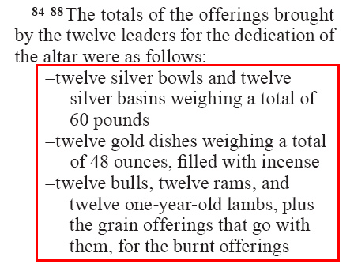
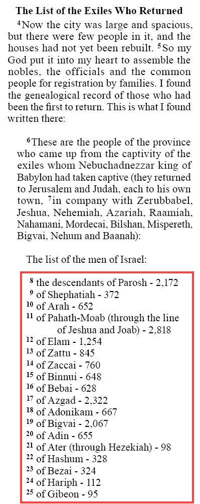

.. include:: /_static/inc_styles.txt

.. index:: lists

Lists
=====

.. _usfmp_lh:
.. index:: marker; \lh, lists; list header

\\lh
^^^^

|badge_3.0|

:Syntax: ``\lh_text...``
:Type: paragraph
:Added: 3.0
:Use: List header. |br|
	Some lists include an introductory and concluding remark (:ref:`\\lf<usfmp_lf>`). They are an integral part of the list content, but are not list items. A list does not require either or both of these elements.

**Text and Formatting Sample** - 1 Chronicles 27:16-22 (GNT - *markup adapted*)

.. code-block:: text
	:name: usfm-paragraph_lh_example
	:emphasize-lines: 2

	\s1 Administration of the Tribes of Israel 
	\lh
	\v 16-22 This is the list of the administrators of the tribes of Israel:
	\li1 Reuben - Eliezer son of Zichri
	\li1 Simeon - Shephatiah son of Maacah
	\li1 Levi - Hashabiah son of Kemuel
	\li1 Aaron - Zadok
	\li1 Judah - Elihu, one of King David's brothers
	\li1 Issachar - Omri son of Michael
	\li1 Zebulun - Ishmaiah son of Obadiah
	\li1 Naphtali - Jeremoth son of Azriel
	\li1 Ephraim - Hoshea son of Azaziah
	\li1 West Manasseh - Joel son of Pedaiah
	\li1 East Manasseh - Iddo son of Zechariah
	\li1 Benjamin - Jaasiel son of Abner
	\li1 Dan - Azarel son of Jeroham
	\lf This was the list of the administrators of the tribes of Israel. 

.. image:: images/usfm-paragraph_lh.jpg
	:width: 250px

-----

.. _usfmp_li#:
.. index:: marker; \li#, lists; list entry

\\li#
^^^^^

:Syntax: ``\li#(_text...)``
:Type: paragraph
:Added: 1.0
:Use: List entry. |br|
	An out-dented paragraph meant to highlight the items of a list. |br|
	Lists may be used to markup the individual entries of a structure such as the days within the creation account, or the Decalogue (10 commandments). |br|
	The variable # represents the level of indent. |br|
	**\\li = \\li1** (see :ref:`syntax notes <syntax_numberedMarkers>` on numbered markers)

**Text and Formatting Sample** - Numbers 7.84-88 (GNT)

.. code-block:: text
	:name: usfm-paragraph_li#_example
	:emphasize-lines: 4,5,6,8,9

	\p
	\v 84-88 The totals of the offerings brought by the twelve leaders for the dedication of 
	the altar were as follows:
	\li –twelve silver bowls and twelve silver basins weighing a total of 60 pounds
	\li –twelve gold dishes weighing a total of 48 ounces, filled with incense
	\li –twelve bulls, twelve rams, and twelve one-year-old lambs, plus the grain offerings that 
	go with them, for the burnt offerings
	\li –twelve goats for the sin offerings
	\li –twenty-four bulls, sixty rams, sixty goats, sixty one-year-old lambs, for the fellowship 
	offerings

-----

.. _usfmp_lf:
.. index:: marker; \lf, lists; list footer

\\lf
^^^^

|badge_3.0|

:Syntax: ``\lf_text...``
:Type: paragraph
:Added: 3.0
:Use: List footer. |br|
	Some lists include an introductory (:ref:`\\lh<usfmp_lh>`) and concluding remark. They are an integral part of the list content, but are not list items. A list does not require either or both of these elements.

**Text and Formatting Sample** - 1 Chronicles 27:16-22 (GNT - *markup adapted*)

.. code-block:: text
	:name: usfm-paragraph_lf_example
	:emphasize-lines: 17

	\s1 Administration of the Tribes of Israel 
	\lh
	\v 16-22 This is the list of the administrators of the tribes of Israel:
	\li1 Reuben - Eliezer son of Zichri
	\li1 Simeon - Shephatiah son of Maacah
	\li1 Levi - Hashabiah son of Kemuel
	\li1 Aaron - Zadok
	\li1 Judah - Elihu, one of King David's brothers
	\li1 Issachar - Omri son of Michael
	\li1 Zebulun - Ishmaiah son of Obadiah
	\li1 Naphtali - Jeremoth son of Azriel
	\li1 Ephraim - Hoshea son of Azaziah
	\li1 West Manasseh - Joel son of Pedaiah
	\li1 East Manasseh - Iddo son of Zechariah
	\li1 Benjamin - Jaasiel son of Abner
	\li1 Dan - Azarel son of Jeroham
	\lf This was the list of the administrators of the tribes of Israel. 

.. image:: images/usfm-paragraph_lf.jpg
	:width: 250px

-----

.. _usfmp_lim#:
.. index:: marker; \lim#, lists; embedded list entry

\\lim#
^^^^^^

|badge_3.0|

:Syntax: ``\lim#(_text...)``
:Type: paragraph
:Added: 3.0
:Use: Embedded list entry. |br|
	An out-dented paragraph meant to highlight the items of an embedded list. |br|
	The variable # represents the level of indent. |br|
	**\\lim = \\lim1** (see :ref:`syntax notes <syntax_numberedMarkers>` on numbered markers) |br|
	|ico_See| *See also* :ref:`\\li# <usfmp_li#>`

**Text and Formatting Sample** - Nehemiah 7.4-25 (NIV)

.. code-block:: text
	:name: usfm-paragraph_lim#_example
	:emphasize-lines: 18,20,22,24,26,28,30

	\s1 The List of the Exiles Who Returned
	\p
	\v 4 Now the city was large and spacious, but there were few people in it, and the 
	houses had not yet been rebuilt.
	\v 5 So my God put it into my heart to assemble the nobles, the officials and the common 
	people for registration by families. I found the genealogical record of those who had 
	been the first to return. This is what I found written there:
	\b
	\pm
	\v 6 These are the people of the province who came up from the captivity of the exiles 
	whom Nebuchadnezzar king of Babylon had taken captive (they returned to Jerusalem and 
	Judah, each to his own town,
	\v 7 in company with Zerubbabel, Jeshua, Nehemiah, Azariah, Raamiah, Nahamani, Mordecai, 
	Bilshan, Mispereth, Bigvai, Nehum and Baanah):
	\b
	\pm The list of the men of Israel:
	\b
	\lim1
	\v 8 the descendants of Parosh - 2,172
	\lim1
	\v 9 of Shephatiah - 372
	\lim1
	\v 10 of Arah - 652
	\lim1
	\v 11 of Pahath-Moab (through the line of Jeshua and Joab) - 2,818
	\lim1
	\v 12 of Elam - 1,254
	\lim1
	\v 13 of Zattu - 845
	\lim1
	\v 14 of Zaccai - 760
	...

-----

.. _usfmc_litl:
.. index:: marker; \litl ...\litl*, lists; list entry total

\\litl ...\\litl\*
^^^^^^^^^^^^^^^^^^

|badge_3.0|

:Syntax: ``\litl text...\litl*``
:Type: character
:Added: 3.0
:Use: List entry total. |br|
	Use in “accounting” lists for denoting the total component of the text within a list item (:ref:`\\li <usfmp_li#>`). An alternative to using :doc:`tables </tables/index>` for the same content.

**Text and Formatting Sample** - Nehemiah 7.6-14 (GNT - *markup adapted*)

.. code-block:: text
	:name: usfm-character_litl_example
	:emphasize-lines: 11,13,15,17,19,21,23

	\pm
	\v 6 These are the people of the province who came up from the captivity of the exiles 
	whom Nebuchadnezzar king of Babylon had taken captive (they returned to Jerusalem and 
	Judah, each to his own town,
	\v 7 in company with Zerubbabel, Jeshua, Nehemiah, Azariah, Raamiah, Nahamani, Mordecai, 
	Bilshan, Mispereth, Bigvai, Nehum and Baanah):
	\b
	\pm The list of the men of Israel:
	\b
	\lim1
	\v 8 the descendants of Parosh - \litl 2,172\litl*
	\lim1
	\v 9 of Shephatiah - \litl 372\litl*
	\lim1
	\v 10 of Arah - \litl 652\litl*
	\lim1
	\v 11 of Pahath-Moab (through the line of Jeshua and Joab) - \litl 2,818\litl*
	\lim1
	\v 12 of Elam - \litl 1,254\litl*
	\lim1
	\v 13 of Zattu - \litl 845\litl*
	\lim1
	\v 14 of Zaccai - \litl 760\litl*
	... 

.. image:: images/usfm-character_litl.jpg
	:width: 250px

-----

.. index:: lists; structured list items, lists; structured entries

Structured List Entries
^^^^^^^^^^^^^^^^^^^^^^^

|badge_3.0|

Standard USFM :doc:`table </tables/index>` structures can be challenging to display on small page sizes, or digital device displays. Scripture content is sometimes encoded within a USFM table in order to suggest a meaningful presentation, but the encoded presentation may only be rendered accurately or legibly in a larger format. The following character marker pairs can be used to create structured list entries which identify a set of related content, but do not encode a specific presentation.

.. note::

	Structured lists are not strictly a replacement for table markup, but may prove to be a more flexible option for some types of tabular content.

Character marker pairs :ref:`\\lik ...\\lik\* <usfmc_lik>` and :ref:`\\liv# ...\\liv#\* <usfmc_liv#>` mark the content of list entries (:ref:`\\li <usfmp_li#>`) which are essentially a key + value pair. A key may have multiple values.

-----

.. _usfmc_lik:
.. index:: marker; \lik ...\lik*, lists; list entry key

\\lik ...\\lik\*
""""""""""""""""

|badge_3.0|

:Syntax: ``\lik text...\lik*``
:Type: character
:Added: 3.0
:Use: List entry "key" content.

-----

.. _usfmc_liv#:
.. index:: marker; \liv# ...\liv#*, lists; list entry value

\\liv# ...\\liv#\*
""""""""""""""""""

|badge_3.0|

:Syntax: ``\liv# text...\liv*``
:Type: character
:Added: 3.0
:Use: List entry "value" content. |br|
	The variable # represents the sequence of the marked item in a list entry with multiple values. |br|
	**\liv = \liv1** (see :ref:`syntax notes <syntax_numberedMarkers>` on numbered markers)

**Text and Formatting Sample** - 1 Chronicles 27:16-22 (GNT - *markup adapted*)

.. code-block:: text
	:name: usfm-character_lik_liv_example
	:emphasize-lines: 4-16

	\s1 Administration of the Tribes of Israel 
	\lh
	\v 16-22 This is the list of the administrators of the tribes of Israel:
	\li1 \lik Reuben\lik* \liv1 Eliezer son of Zichri\liv1*
	\li1 \lik Simeon\lik* \liv1 Shephatiah son of Maacah\liv1*
	\li1 \lik Levi\lik* \liv1 Hashabiah son of Kemuel\liv1*
	\li1 \lik Aaron\lik* \liv1 Zadok\liv1*
	\li1 \lik Judah\lik* \liv1 Elihu, one of King David's brothers\liv1*
	\li1 \lik Issachar\lik* \liv1 Omri son of Michael\liv1*
	\li1 \lik Zebulun\lik* \liv1 Ishmaiah son of Obadiah\liv1*
	\li1 \lik Naphtali\lik* \liv1 Jeremoth son of Azriel\liv1*
	\li1 \lik Ephraim\lik* \liv1 Hoshea son of Azaziah\liv1*
	\li1 \lik West Manasseh\lik* \liv1 Joel son of Pedaiah\liv1*
	\li1 \lik East Manasseh\lik* \liv1 Iddo son of Zechariah\liv1*
	\li1 \lik Benjamin\lik* \liv1 Jaasiel son of Abner\liv1*
	\li1 \lik Dan\lik* \liv1 Azarel son of Jeroham\liv1*
	\lf This was the list of the administrators of the tribes of Israel. 

.. image:: images/usfm-character_lik_liv.jpg
	:width: 250px
