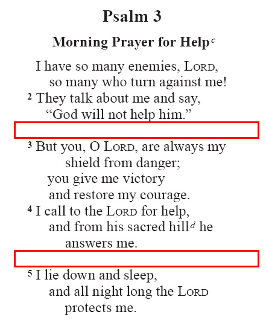

.. include:: /_static/inc_styles.txt

.. index:: poetry

Poetry
======

.. _usfmp_q#:
.. index:: marker; \q#, poetry; poetic line

\\q#
^^^^

:Syntax: ``\q#(_text...)``
:Type: paragraph
:Added: 1.0
:Use: Poetic line. |br|
	The variable # represents the level of indent (i.e. \q1, \q2, \q3 etc.). |br|
	**\\q = \\q1** (see :ref:`syntax notes <syntax_numberedMarkers>` on numbered markers) 

**Text and Formatting Examples** - Habakkuk 3.1-2 (GNT)

.. code-block:: text
	:name: usfm-paragraph_q1_example
	:emphasize-lines: 6,9,11

	\c 3
	\s1 A Prayer of Habakkuk
	\p
	\v 1 This is a prayer of the prophet Habakkuk:
	\b
	\q1
	\v 2 O \nd Lord\nd*, I have heard of what you have done,
	\q2 and I am filled with awe.
	\q1 Now do again in our times
	\q2 the great deeds you used to do.
	\q1 Be merciful, even when you are angry.

.. image:: images/usfm-paragraph_q1.jpg
	:width: 250px

.. code-block:: text
	:name: usfm-paragraph_q2_example
	:emphasize-lines: 3,5

	\q1
	\v 2 O \nd Lord\nd*, I have heard of what you have done,
	\q2 and I am filled with awe.
	\q1 Now do again in our times
	\q2 the great deeds you used to do.
	\q1 Be merciful, even when you are angry.

.. image:: images/usfm-paragraph_q2.jpg
	:width: 250px

-----

.. _usfmp_qr:
.. index:: marker; \qr, poetry; right-aligned poetic line

\\qr
^^^^

:Syntax: ``\qr_text...``
:Type: paragraph
:Added: 1.0
:Use: Right-aligned poetic line. |br|
	Commonly used for a poetic refrain. |br|

**Text and Formatting Sample** - Psalm 136.1-3 (CEV - *markup adapted*)

.. code-block:: text
	:name: usfm-paragraph_qr_example
	:emphasize-lines: 5,8,11

	\c 136
	\s1 God's Love Never Fails
	\q1
	\v 1 Praise the \nd Lord\nd*! He is good.
	\qr God's love never fails.
	\q1
	\v 2 Praise the God of all gods.
	\qr God's love never fails.
	\q1
	\v 3 Praise the Lord of lords.
	\qr God's love never fails.

.. image:: images/usfm-paragraph_qr.jpg
	:width: 250px

-----

.. _usfmp_qc:
.. index:: marker; \qc, poetry; centered poetic line

\\qc
^^^^

:Syntax: ``\qc_text...``
:Type: paragraph
:Added: 1.0
:Use: Centered poetic line.

**Text and Formatting Sample** - Psalm 72.19 (GNT)

.. code-block:: text
	:name: usfm-paragraph_qc_example
	:emphasize-lines: 8

	\q1
	\v 18 Praise the \nd Lord\nd*, the God of Israel!
	\q1 He alone does these wonderful things.
	\q1
	\v 19 Praise his glorious name forever!
	\q1 May his glory fill the whole world.
	\b
	\qc Amen! Amen!
	\b
	\q1
	\v 20 This is the end of the prayers of David son of Jesse.

.. image:: images/usfm-paragraph_qc.jpg
	:width: 250px

-----

.. _usfmc_qs:
.. index:: marker; \qs ...\qs*, poetry; selah text

\\qs ...\\qs\*
^^^^^^^^^^^^^^

:Syntax: ``\qs_(Selah)\qs*``
:Type: character
:Added: 1.0
:Use: Used for the expression "Selah" commonly found in Psalms and Habakkuk. |br|
	*A character style.* |br|
	This text is frequently right aligned, and rendered on the same line as the previous poetic text, if space allows.

**Text and Formatting Samples** - Psalm 3.2 (NRSV)

.. code-block:: text
	:name: usfm-character_qs_example
	:emphasize-lines: 9

	\c 3
	\s1 Trust in God under Adversity
	\d A Psalm of David, when he fled from his son Absalom.
	\q1
	\v 1 O \nd Lord\nd*, how many are my foes!
	\q2 Many are rising against me;
	\q1
	\v 2 many are saying to me,
	\q2 “There is no help for you \qs Selah\qs*

.. image:: images/usfm-character_qs.jpg
	:width: 250px

Psalm 24.10 (NRSV)

.. code-block:: text
	:name: usfm-character_qs_example-alt
	:emphasize-lines: 4

	\q1
	\v 10 Who is this King of glory?
	\q2 The \nd Lord\nd* of hosts,
	\q2 he is the King of glory. \qs Selah\qs*

.. image:: images/usfm-character_qs-alt.jpg
	:width: 250px

-----

.. _usfmp_qa:
.. index:: marker; \qa, poetry; acrostic heading

\\qa
^^^^

:Syntax: ``\qa_text...``
:Type: paragraph
:Added: 1.0
:Use: Acrostic heading.

**Text and Formatting Sample** - Psalm 119 (NIV)

.. code-block:: text
	:name: usfm-paragraph_qa_example
	:emphasize-lines: 2,7

	\c 119
	\qa Aleph
	\q1
	\v 1 Blessed are they whose ways are blameless,
	\q2 who walk according to the law of the \nd Lord\nd*.
	...
	\qa Beth
	\q1
	\v 9 How can a young man keep his way pure?
	\q2 By living according to your word.

.. image:: images/usfm-paragraph_qa.jpg
	:width: 250px

-----

.. _usfmc_qac:
.. index:: marker; \qac ...\qac*, poetry; acrostic letter

\\qac ...\\qac\*
^^^^^^^^^^^^^^^^

:Syntax: ``\qac_text...\qac*``
:Type: character
:Added: 1.0
:Use: Marker to indicate the acrostic letter within a poetic line. |br|
	*A character style.*

**Text and Formatting Sample** - Lamentations 1.1,2 (Spanish TLA)

.. code-block:: text
	:name: usfm-character_qac_example
	:emphasize-lines: 5,15

	\c 1
	\s1 Primer lamento acróstico
	\s2 El profeta
	\q1
	\v 1 ¡\qac P\qac*obrecita de ti, Jerusalén!
	\q1 Antes eras la más famosa
	\q1 de todas las ciudades.
	\q1 ¡Antes estabas llena de gente,
	\q1 pero te has quedado muy sola,
	\q1 te has quedado viuda!
	\q1 ¡Fuiste la reina de las naciones,
	\q1 pero hoy eres esclava de ellas!
	\b
	\q1
	\v 2 \qac O\qac*lvidada y bañada en lágrimas
	\q1 pasas todas las noches.
	\q1 Muchos decían que te amaban,
	\q1 pero hoy nadie te consuela.
	\q1 Los que se decían tus amigos
	\q1 hoy son tus enemigos.

.. image:: images/usfm-character_qac.jpg
	:width: 250px

-----

.. _usfmp_qm#:
.. index:: marker; \qm#, poetry; embedded text poetic line

\\qm#
^^^^^

:Syntax: ``\qm#(_text...)``
:Type: paragraph
:Added: 2.0
:Use: Embedded text poetic line. |br|
	The variable # represents the level of indent (i.e. \\qm1, \\qm2 etc.). |br|
	**\\qm = \\qm1** (see :ref:`syntax notes <syntax_numberedMarkers>` on numbered markers)

**Text and Formatting Sample** - 1 Chronicles 12.18 (GNT - *markup adapted*)

.. code-block:: text
	:name: usfm-paragraph_qm#_example
	:emphasize-lines: 4-6

	\p
	\v 18 God's spirit took control of one of them, Amasai, who later became the commander 
	of “The Thirty,” and he called out,
	\qm1 “David son of Jesse, we are yours!
	\qm1 Success to you and those who help you!
	\qm1 God is on your side.”
	\b
	\m David welcomed them and made them officers in his army.

.. image:: images/usfm-paragraph_qm.jpg
	:width: 250px

-----

.. _usfmp_qd:
.. index:: marker; \qd, poetry; Hebrew note

\\qd
^^^^

|badge_3.0|

:Syntax: ``\\qd_text...``
:Type: paragraph
:Added: 3.0
:Use: Hebrew note. |br|
	A Hebrew musical performance comment similar in content to many of the Hebrew Psalm titles (:ref:`\\d <usfmp_d>`), but placed at the end of the poetic section.

**Text and Formatting Sample** - Habakkuk 3:19 (NIV)

.. code-block:: text
	:name: usfm-paragraph_qd_example
	:emphasize-lines: 8

	\q1 \v 18 yet I will rejoice in the \nd Lord\nd*,
	\q2 I will be joyful in God my Savior.
	\b 
	\q1 \v 19 The Sovereign \nd Lord\nd* is my strength;
	\q2 he makes my feet like the feet of a deer,
	\q2 he enables me to tread on the heights.
	\b 
	\qd For the director of music. On my stringed instruments.

.. image:: images/usfm-paragraph_qd.jpg
	:width: 250px

-----

.. _usfmp_b:
.. index:: marker; \b, poetry; blank line/stanza break

\\b
^^^

:Syntax: ``\b``
:Type: paragraph
:Added: 1.0
:Use: Blank line. |br|
	Use for stanza breaks in poetry, or between poetry and prose.

.. warning::

	No text should follow this marker, and it should not be used before or after titles to indicate white-space.

**Text and Formatting Samples** - Psalm 3 (GNT)

.. code-block:: text
	:name: usfm-paragraph_b_example
	:emphasize-lines: 9,17

	\c 3
	\s1 Morning Prayer for Help
	\q1
	\v 1 I have so many enemies, \nd Lord\nd*,
	\q2 so many who turn against me!
	\q1
	\v 2 They talk about me and say,
	\q2 “God will not help him.”
	\b
	\q1
	\v 3 But you, O \nd Lord\nd*, are always my shield from danger;
	\q2 you give me victory
	\q2 and restore my courage.
	\q1
	\v 4 I call to the \nd Lord\nd* for help,
	\q2 and from his sacred hill he answers me.
	\b
	\q1
	\v 5 I lie down and sleep,
	\q2 and all night long the \nd Lord\nd* protects me.
	\q1
	\v 6 I am not afraid of the thousands of enemies
	\q2 who surround me on every side.

Habakkuk 3.1 (GNT)

.. code-block:: text
	:name: usfm-paragraph_b_example-alt
	:emphasize-lines: 5

	\c 3
	\s1 A Prayer of Habakkuk
	\p
	\v 1 This is a prayer of the prophet Habakkuk:
	\b
	\q1
	\v 2 O \nd Lord\nd*, I have heard of what you have done,
	\q2 and I am filled with awe.

.. image:: images/usfm-paragraph_b-alt.jpg
	:width: 250px